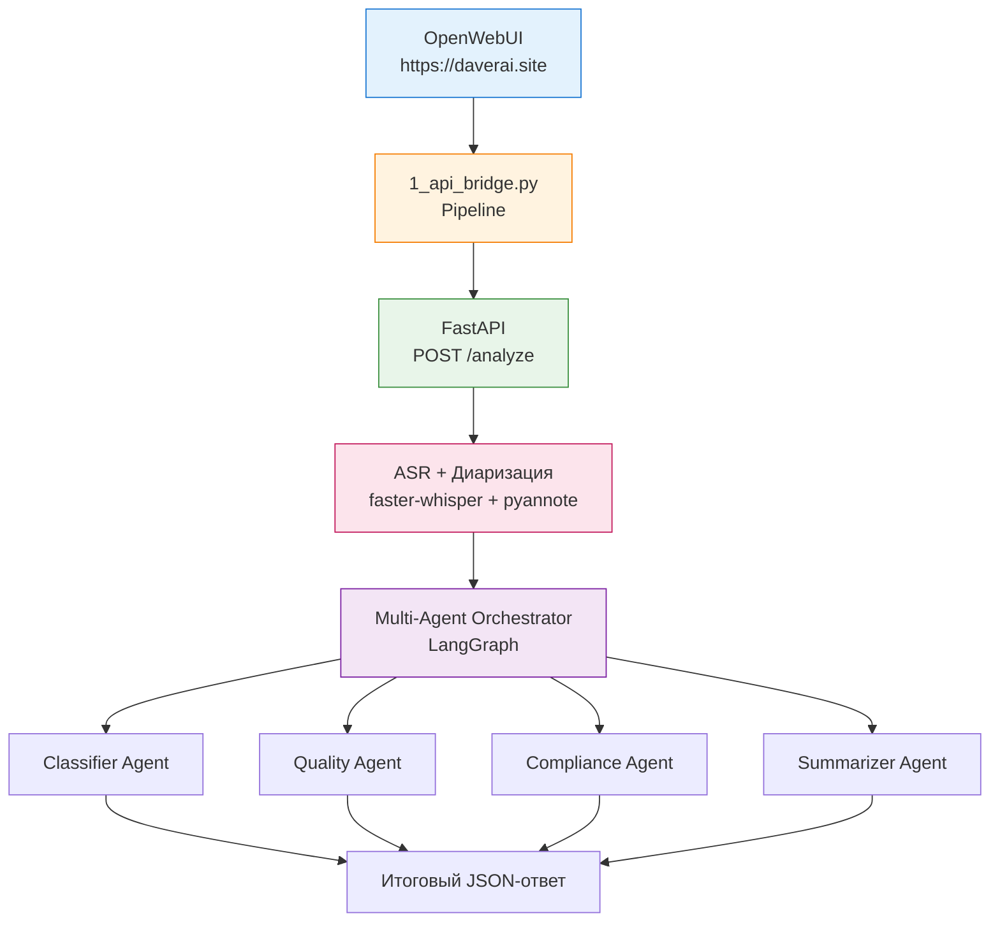

# MTBank Call Analytics Pipeline

Система автоматического анализа звонков контакт-центра МТБанка на базе OpenWebUI Pipelines, ASR и Multi-Agent архитектуры.

## Архитектура

```
OpenWebUI (https://daverai.site)
          ↓
1_api_bridge.py (Pipeline)
          ↓
FastAPI (/analyze)
          ↓
   ┌──────────────────────┐
   │  ASR + Диаризация    │
   │  faster-whisper +    │
   │  pyannote            │
   └──────────────────────┘
          ↓
   ┌──────────────────────┐
   │  Multi-Agent         │
   │  (LangGraph)         │
   │  - Classifier        │
   │  - Quality           │
   │  - Compliance        │
   │  - Summarizer        │
   └──────────────────────┘
```

## Технологический стек

- **Pipeline**: OpenWebUI Pipelines
- **ASR**: faster-whisper (medium, int8)
- **Диаризация**: pyannote/speaker-diarization-3.1
- **LLM**: Groq (`llama-3.3-70b-versatile`)
- **Оркестрация**: LangGraph
- **Backend**: FastAPI
- **Инфраструктура**: Docker Compose

## Тестовые данные

В папке `test_data/` находятся 5 аудиофайлов с эталонными транскриптами:

| Файл                  | Длительность | Особенность          | WER    |
|-----------------------|--------------|----------------------|--------|
| call_01_dialog.wav    | ~2 мин       | Диалог 2 спикеров    | 1.97%  |
| call_02_8khz.wav      | ~2 мин       | 8kHz (телефон)       | 3.45%  |
| call_03_mono.wav      | ~1 мин       | Чистая речь          | 0.00%  |
| call_04_mono.wav      | ~1 мин       | Сложный случай       | 11.11% |
| call_05_mono.wav      | ~1 мин       | Средняя сложность    | 5.88%  |

**Средний WER: 4.48%**

## Установка и запуск

```bash
# Клонирование репозитория
git clone <repository-url>
cd mtbank-ai-hiring

# Запуск всех сервисов
docker compose up -d
```

После запуска:
- OpenWebUI доступен по адресу: `https://daverai.site`
- API доступен на порту `8000`

## Результаты работы

Пример вывода системы:

```json
{
  "classification": {
    "topic": "кредиты",
    "priority": "medium"
  },
  "quality_score": {
    "total": 78,
    "checklist": {
      "greeting": true,
      "need_detection": true,
      "solution_provided": true,
      "farewell": false
    }
  },
  "compliance": {
    "passed": true,
    "issues": []
  },
  "summary": "Клиент обратился по вопросу кредитного продукта...",
  "action_items": [
    "Отправить КП на email клиента",
    "Перезвонить через 2 дня"
  ]
}
```

## Обоснование ключевых решений

- **Groq (`llama-3.3-70b-versatile`)**: Выбран вместо локальной модели `qwen2.5:7b` из-за значительно лучшего качества генерации и следования инструкциям.
- **LangGraph**: Использован для оркестрации агентов, так как позволяет гибко управлять потоком выполнения и состоянием.
- **OpenWebUI Pipelines**: Обязательное требование тестового задания. Pipeline выступает как точка входа и прокси.
- **faster-whisper + pyannote**: Выбраны как наиболее зрелые open-source решения для ASR и диаризации.

## Деплой

Проект развёрнут на DigitalOcean Droplet:
- Домен: `https://daverai.site`
- Nginx + Let's Encrypt настроены
- Автоматическое продление SSL-сертификата включено

## Возможные улучшения

- Ускорение обработки за счёт отключения диаризации или использования более лёгкой модели Whisper
- Добавление кэширования результатов анализа
- Улучшение промптов агентов
- Реализация параллельного выполнения агентов

## Автор

Sergey Postnikov

## PS

## Архитектура

