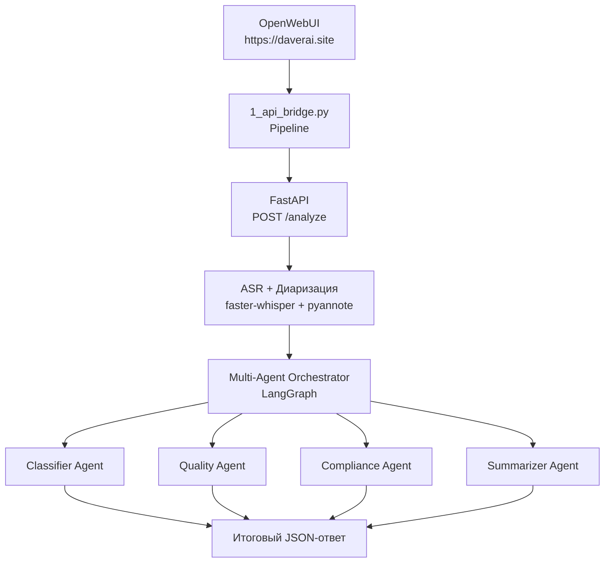

# MTBank Call Analytics Pipeline

Автоматизированная система анализа звонков контакт-центра МТБанка на базе OpenWebUI Pipelines, ASR и Multi-Agent архитектуры.

## Описание проекта

Система позволяет автоматически:
- Транскрибировать аудиозаписи звонков
- Разделять участников разговора (диаризация)
- Анализировать качество обслуживания с помощью нескольких LLM-агентов
- Выявлять нарушения compliance
- Формировать резюме и рекомендации (action items)

## Архитектура



## Технологический стек

| Компонент              | Технология                              | Примечание |
|------------------------|-----------------------------------------|----------|
| **Pipeline**           | OpenWebUI Pipelines                     | Обязательное требование |
| **ASR**                | faster-whisper (medium, int8)           | Хорошее соотношение скорость/качество |
| **Диаризация**         | pyannote/speaker-diarization-3.1        | Разделение спикеров |
| **LLM**                | Groq (`llama-3.3-70b-versatile`)        | Высокое качество и скорость |
| **Оркестрация агентов**| LangGraph                               | Гибкое управление потоком |
| **Backend**            | FastAPI + Pydantic v2                   | Современный стек |
| **Инфраструктура**     | Docker Compose                          | Простой запуск |
| **Reverse Proxy**      | Nginx + Let's Encrypt                   | HTTPS на проде |

## Тестовые данные и метрики качества

В репозитории находятся 5 тестовых аудиофайлов с эталонными транскриптами.

| Файл                    | Длительность | Особенность             | WER    | Комментарий |
|-------------------------|--------------|-------------------------|--------|-------------|
| `call_01_dialog.wav`    | ~2 мин       | Диалог 2 спикеров       | 1.97%  | Отлично |
| `call_02_8khz.wav`      | ~2 мин       | Телефонное качество     | 3.45%  | Хорошо |
| `call_03_mono.wav`      | ~1 мин       | Чистая речь             | 0.00%  | Идеально |
| `call_04_mono.wav`      | ~1 мин       | Сложный случай          | 11.11% | Требует внимания |
| `call_05_mono.wav`      | ~1 мин       | Средняя сложность       | 5.88%  | Приемлемо |

**Средний WER: 4.48%**

## Установка и запуск

### Локальный запуск

```bash
git clone <repository>
cd mtbank-ai-hiring

# Запуск всех сервисов
docker compose up -d
```

### Доступ к системе

- **OpenWebUI**: `https://daverai.site`
- **Pipeline**: порт `9099`
- **FastAPI**: порт `8000`

## Как работает система

1. Пользователь загружает аудиофайл в OpenWebUI
2. Pipeline (`1_api_bridge.py`) принимает файл и сохраняет его во временный файл
3. Файл отправляется на `POST /analyze` в FastAPI
4. Выполняется транскрибация + диаризация
5. Запускается цепочка из 4 агентов через LangGraph:
   - **Classifier** — определяет тему и приоритет
   - **Quality** — оценивает качество обслуживания по чек-листу
   - **Compliance** — проверяет нарушения
   - **Summarizer** — формирует резюме и action items
6. Результат возвращается в чат OpenWebUI

## Обоснование ключевых решений

- **Groq вместо локальной модели** — `qwen2.5:7b` показывал слабое следование инструкциям и нестабильный structured output. `llama-3.3-70b` через Groq даёт значительно лучшее качество.
- **LangGraph** — выбран вместо простого Supervisor из-за гибкости, возможности добавлять циклы и удобной работы с состоянием.
- **Чтение файлов через volume mount** — отказ от HTTP-запросов к OpenWebUI API позволил избавиться от проблем с авторизацией (401).
- **Кэширование результатов** в Pipeline — решает проблему "Querying..." в OpenWebUI при повторных вызовах `pipe`.

## Структура проекта

```
├── api/                    # FastAPI сервис
├── agents/                 # 4 LLM-агента
├── asr/                    # Транскрибация и диаризация
├── core/llm/               # Клиенты LLM (Groq, Ollama)
├── multiagent/             # LangGraph оркестратор
├── pipelines/              # OpenWebUI Pipeline
├── test_data/              # Тестовые аудиофайлы
├── docker-compose.yml
└── README.md
```

## Возможные улучшения

- Отключение диаризации для ускорения обработки
- Использование более лёгкой модели Whisper (`small` / `base`)
- Параллельное выполнение независимых агентов
- Добавление кэширования результатов анализа
- Улучшение промптов и structured output

## Автор

**Sergey Postnikov**

---

*Проект выполнен в рамках тестового задания на позицию AI Engineer в МТБанк.*